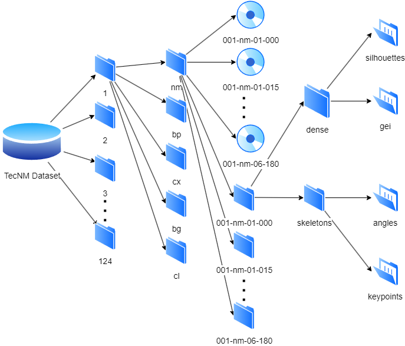

# Developing of a Multi-Angle and Varied Walking Conditions dataset for Human Gait Recognition
## Abstract
The burgeoning field of Human Gait Recognition (HGR) capitalizes on non-invasive identification through unique walking patterns, offering a discreet and versatile biometric modality. This article explores the significance of comprehensive datasets for algorithm development, testing, and validation in HGR. While gait-based identification excels in scenarios requiring discretion and at-a-distance verification, its effectiveness is contingent on system accuracy. Researchers employ model-based and appearance-based approaches, each with distinct trade-offs, necessitating well-constructed datasets for robust algorithm development. Existing datasets, exemplified by CMU MoBo, SOTON, CASIA B, and OU-ISIR, have significantly evolved in scale and complexity, addressing challenges of diversity and sample representation. The introduction of TecNM Gait-DS, tailored for Latin American populations, presents a novel dataset with 13 viewing angles, five walking variations, and rich feature sets. The dataset undergoes a detailed evaluation using the Transformer Dino VIT model, showcasing its potential for advancing HGR technology. Key areas of opportunity, such as sample diversity, accuracy enhancement, and ethical considerations, underscore the importance of continually refining gait recognition datasets for optimal system performance and societal acceptance.
## TecNM Gait-DS
The organization of the dataset is described as follows:

1. **Subjects**: There are 124 subjects in the dataset. Each subject is represented by a dedicated folder.
 1.1 **Walking Variants**: Each subject's folder contains five subfolders representing different walking variants.
   - Normal walking (`nm`)
   - Carrying a backpack (`bp`)
   - Carrying a bag (`bg`)
   - Carrying a box (`cx`)
   - Wearing a coat (`cl`)
    1.1.1 **Videos**: Each walking variant folder contains batches of videos.
     - In the `nm` folder, there are 6 * α = 78 videos.
     - In the other walking variant folders, there are 2 * α = 26 videos each.
     - Each video corresponds to a combination of a specific walking variant, walk instance, and angle.
     - The "Normal walking" folder has videos from 6 batches and 13 different angles.
     - The other walking variant folders have videos from 2 batches and 13 different angles.
     - The name of each video corresponds to the following nomenclature: $sub-wv-vb-\alpha$. Where $sub$ is the subject number (from 001 to 124), $wv$ is the walking variant (`nm`, `bg`, `bp`, `cl`, `cx`), $vb$ is the video batch number (01 to 06 in `nm` and 01 to 02 in the other `wv`), and $\alpha$ is the corresponding angle.
    1.1.2 **Extracted Features**: Each video has a dedicated folder (with the same name as the video) inside the corresponding walking variant folder. Inside these video folders, there are subfolders for extracted features. These feature folders are divided into two main categories. 
     - `dense`
     - `skeletons`
      1.1.2.1 **dense**: The "dense" folder contains two subfolders: 
       - `silhouettes`: the "silhouettes" folder contains all the silhouettes extracted from each frame of the video.
       - `gei`: the "gei" folder contains a gait energy image generated from all previously extracted silhouettes.
      1.1.2.2 **skeletons**: Inside the "skeletons" folder, there are two subfolders.
       - `angles`: contains CSV files with angle measurements derived from the skeleton data of each video frame.
       - `keypoints`: contains CSV files with key point coordinates extracted from each video frame's skeleton.

This hierarchical structure allows for organized storage and retrieval of video data as shown in Fig. [Dataset hierarchical structure](img/hierarchical.png).

To apply for TecNM Gait-DS please send this application [TecNM Gait-DS agreement](/TecNM_Gait-DS_agreement.pdf) to D13170395@culiacan.tecnm.mx.
